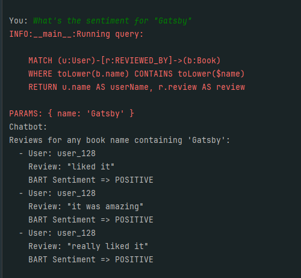

# LLM Final Project - Building a Knowledge Graph enriched with Large Language Models and Linked to DBpedia

## Project Description
This project aims to build a knowledge graph enriched with large language models and linked to DBpedia. The knowledge graph will be built using the Neo4j library and the LangChain library. The knowledge graph will be linked to DBpedia using the [SPARQLWrapper](https://rdflib.dev/sparqlwrapper/) library. The project will be implemented in Python.

## Requirements
- Python 3.12
- Docker
- Docker Compose

## Installation
1. Clone the repository
```bash
git clone https://github.com/theFellandes/LLM-Final-Project
```
2. Change the directory to the repository
```bash
cd LLM-Final-Project
```
3. Run the following command to start the neo4j database
```bash
docker-compose up -d
```
4. Install the required python packages
```bash
pip install -r requirements.txt
```

## Usage
To create the knowledge graph, run the following command:
```bash
python graph_generator.py -> This script will start to read data from Kagglehub and generate the knowledge graph
python graph_generator_user_rating.py -> This script will also read the data from Kagglehub however it will start from the user rating data
```

To observe the knowledge graph generated by script, open your browser and go to `http://localhost:7474/`. The default username is `neo4j` and the password is `your_password`.

## Project Structure
``graph_generator.py`` - The main script that reads csv file and create the knowledge graph from the csv file.

``graph_generator_user_rating.py`` - The main script that reads csv file and create the knowledge graph from the csv file.

``docker_reader.py`` - This is the class for reading docker-compose.yml file and get the username, password and connection string values.

`legacy` - The directory that contains the trial and error scripts.

`internal` - The directory that contains the internal modules of the project.

``internal/db/neo4j_handler.py`` - This is the class for performing Neo4j operations

``internal/graph/graph_llm.py`` - Even though this class isn't used at the moment, this is for enriching the knowledge graph using llm.

``internal/graph/knowledge_graph_builder.py`` - Even though this class isn't used at the moment, this is for enriching the knowledge graph using llm.

``internal/reader/yaml_reader.py`` - Parent class for docker_reader.py. This class reads general yaml files.

``internal/graph/dbpedia/dbpedia_integration2.py`` - Standalone script for creating genres using DBPedia.

``internal/graph/dbpedia/dbpedia_awards.py`` - Standalone script for creating awards using DBPedia.

``internal/graph/dbpedia/dbpedia_description.py`` - Standalone script for creating descriptions using DBPedia.

``internal/graph/llm/bart_sentiment_analysis.py`` - Standalone script for sentiment analysis using BART.

``internal/graph/llm/llm_sentiment_analysis.py`` - Standalone script for sentiment analysis using multiple llms.

``internal/graph/llm/llm_similarity_langchain.py`` - Standalone script for similarity analysis using multiple llms. (WORK IN PROGRESS)

``requirements.txt`` - The file that contains the required python packages.

``Dockerfile`` - The file that contains the docker configuration for the neo4j database.

``docker-compose.yml`` - The file that contains the docker compose configuration for the neo4j database.

``scrapper`` - Fetching and manipulating data happens in this folder's contents.

``.env`` - The file that contains the environment variables for the docker compose.

``.gitignore`` - The file that contains the files and directories that are ignored by git.

``README.md`` - The file that contains the information about the project.

## Results & Challenges

The project was hard at the creating the knowledge graph part. Because it took too much time to store the data onto Neo4j. Many methods were tested in this stage of the project, the data processing part. One of the tried method was running csv through a Python script and then insert it into Neo4j. 
This was time-consuming however it was the most effective in the case of accuracy because due to synchronized approach, it ensured the connection was never lost with the Neo4j server.
The other method was to use the Neo4j's own import tool. This was faster than the previous method however it was not as accurate as the previous method. The reason for this was the connection between the Neo4j server and the import tool was not as synchronized as the previous method. This caused some data loss in the process.
Due to utilizing asynchronous method using apoc library, the data loss was huge. Another method was to apply concurrency with Python. This had the connection pooling issues with local Neo4j server. There were so many race condition errors and connection errors, I've abandoned this method.


Tried methods can be found under the legacy folder. pooling&graphql contains the concurrency script as well as connecting to dbpedia.


## Progress

This graph is the first version of the knowledge graph. This contains only the data and nothing else. The next version will contain the data enriched with the large language models and sparql.


This graph is the second version of the knowledge graph. It was filled using APOC and added DBpedia data to enrich the graph with genres and awards.


In version 2, these are the labels.


Also in version 2, descriptions were added.


In version 3, the sentiment analysis was performed on the graph.



Also in this version, the sentiment analysis was performed using OpenAI and BART.


## Authors
- [Oğuzhan Güngör](https://github.com/theFellandes/)